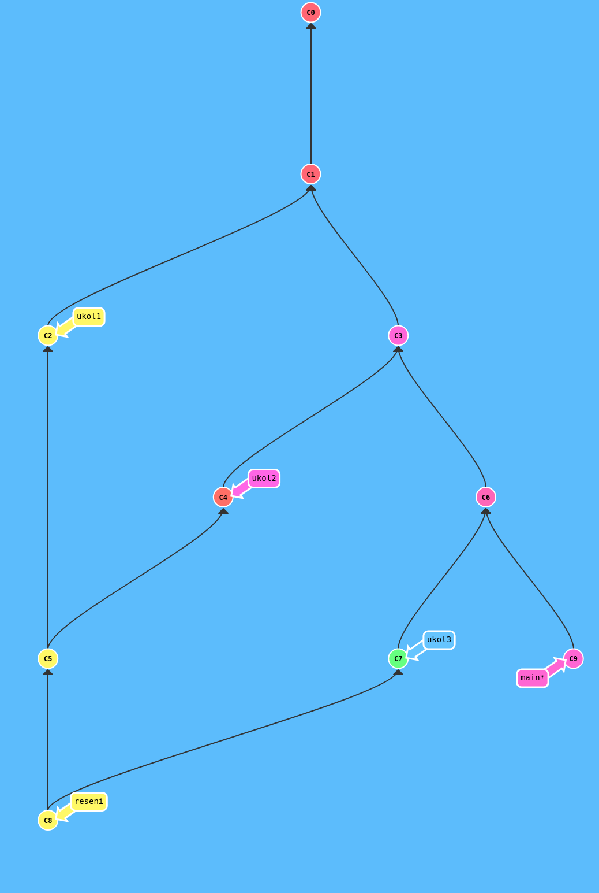

# Python a jeho knihovny - kurz od PyLadies Brno

Repozitář k navazujícímu kurzu Pythonu

| Lekce | Datum      | Lektor |  Délka | Obsah lekce                              |
| ----: | ---------- | ------ | -----: | ---------------------------------------- |
|    01 | 2025-02-17 | Martin | 2:00 h | [Opakování cyklů, comprehensions][cykly] |
|    02 | 2025-02-24 | Martin | 2:00 h | [Parametry příkazové řádky][params]      |
|    03 | 2025-03-03 | Luděk  | 2:00 h | [Úvod do datové analýzy][dta-uvod]       |
|    04 | 2025-03-10 | Luděk  | 2:30 h | Pandas                                   |
|    05 | 2025-03-17 | Luděk  | 2:30 h | [SQL][sql]                               |
|    06 | 2025-03-24 | Martin | 2:30 h | [GitHub a pull requesty][gh]             |
|    07 | 2025-03-31 | Martin | 2:30 h | [GitHub a pull requesty][gh] pokračování |
|    08 | 2025-04-07 | Luděk  | 2:30 h | API                                      |
|    09 | 2025-04-14 | Luděk  | 2:30 h | Webscraping (Selenium)                   |
|       | 2025-04-21 |        |        | Velikonční pondělí                       |
|    10 | 2025-04-28 | Luděk  | 2:30 h | Vizualizace                              |
|    11 | 2025-05-05 | Martin | 2:30 h | [Regulární výrazy][regexp]               |

[cykly]: https://kodim.cz/czechitas/uvod-do-progr-2/bonusy/cykly-2/cyklus-s-ciselnou-radou
[params]: https://kodim.cz/czechitas/uvod-do-progr-2/bonusy/parametry-prikazove-radky/parametry
[regexp]: https://kodim.cz/czechitas/python-data-1/ziskavani-dat/regularni-vyrazy/regularni-vyrazy
[dta-uvod]: https://blackdeck.cz/dta-uvod
[gh]: https://github.com/PyLadiesCZ-Brno/python-knihovny/tree/main/06#readme
[sql]: https://dta-sql.streamlit.app/

## Odevzdávání úkolů

* Nastavte si _Watch all activity_ v tomto repozitáři.
* Vytvořte si _fork_ tohoto repozitáře pomocí tlačítka _Fork_. Tento repozitář
  obsahuje pouze větev `main`, takže je jedno, jestli necháte zaškrtnuto _Copy
  the `main` branch only_ nebo ne. Forky public repozítářů jsou také public.
* Do `main` branch vašeho forku nikdy necommitujte. Tuto branch vždy
  aktualizujte pomocí tlačítka _Sync fork_ a _Update branch_.
* Vytvořte si branch `reseni`. Do této branche taky nikdy necommitujte. Bude
  sloužit pouze jako cíl vašich pull requestů s řešeními jednotlivých úkolů.
* K řešení každého úkolu si vytvořte separátní branch z branche `main`. Název
  branche bude např. `ukol-banka`.
* Po commitnutí řešení otevřte pull request v rámci vašeho forku z branch
  `ukol-banka` do branch `reseni`.
* Dejte _mention_ na kouče pomocí @, popř. je pozvěte do vašeho forku jako
  collaboratory.
* Po schválení PR (opravení úkolu) můžete PR zamergovat do branche `reseni`.



## Seznam kouču

```
@tomato42 @ZelenyMartin @dslavicek @JKafka97 @ninabel @vanovap @OndraVagner
```
